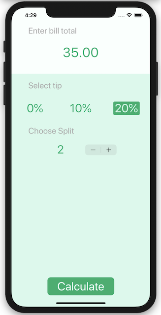

# Tipsy

&nbsp;&nbsp;&nbsp;&nbsp;&nbsp;&nbsp;&nbsp;&nbsp;&nbsp;&nbsp;

## My Goal

The goal of this challenge is to learn more about Optionals, build a full functional app, and to solidify my understanding of segues into other Viewpoints with Xcode.

## What I created

I created a tip calculator. Based on the user’s total bill Tipsy will calculate their total bill plus tip percentage and split the bill according to the size of the party. 

## What I learned

* How to create multi-screen apps with animated navigation.
* Optional binding, optional chaining and the nil coalescing operator. 
* Formatting Strings.

>This is a companion project to The App Brewery's Complete App Development Bootcamp, check out the full course at [www.appbrewery.co](https://www.appbrewery.co/)

